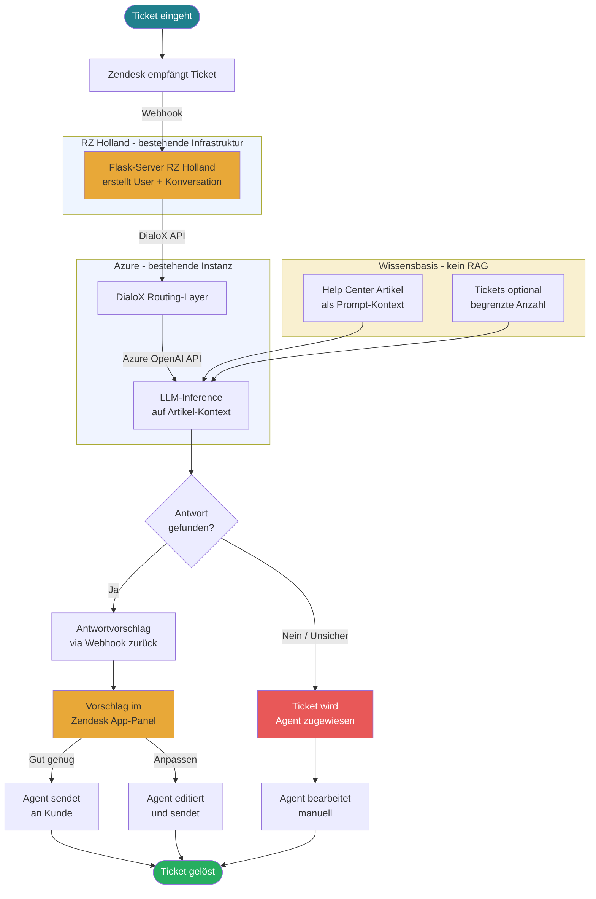

# KI-Support-Strategie: Variantenvergleich

> **Hinweis Zendesk Light Agents:** Light Agents sind in der Suite Professional bereits inklusive — keine zusätzliche Lizenz.  
> **Hinweis Rovo:** Jeder User mit Zugriff wird berechnet, also auch alle 100 Light Agents. Rovo-Abfragen sind auf den jeweiligen Zugriffsbereich des Agenten beschränkt — Tickets außerhalb seines Bereichs werden nicht berücksichtigt.

---

## Weg 1 — Zendesk Native AI

> **Empfehlung:** Nur geeignet wenn kein eigenes technisches Know-how vorhanden ist und L1-Tickets dominieren. Für L2/L3-lastigen Support wie Enreach/Swyx **nicht empfohlen** — teuerste Option ohne Zugriff auf historische Ticket-Lösungen.

### Kosten Weg 1

| Position | Kosten |
|----------|--------|
| Suite Professional | 40 × 115 EUR = 4.600 EUR/Monat |
| Copilot Add-on | 40 × 50 EUR = 2.000 EUR/Monat |
| Automated Resolutions | 50/Agent × 2 EUR = 3.390 EUR/Monat |
| Light Agents | inklusive |
| **Gesamt pro Monat** | **ca. 10.600 EUR** |
| **Gesamt pro Jahr** | **ca. 127.200 EUR** |

---

## Weg 1b — DialoX via Flask-Server (RZ Holland)

> **Empfehlung:** Guter Zwischenschritt als schneller Proof-of-Concept, da Webhook-Integration bereits vorhanden ist. Kein RAG bedeutet jedoch: Bei steigender Ticket-Menge sinkt die Antwortqualität, da kein semantisches Retrieval stattfindet. Geeignet für Help-Center-Artikel als Wissensbasis. Für historische Tickets nur mit Limit sinnvoll. Mittelfristig durch Weg 2 oder 4 ersetzen.

### Kosten Weg 1b

| Position | Kosten |
|----------|--------|
| Flask-Server RZ Holland | bereits vorhanden |
| DialoX Lizenz | bestehender Vertrag |
| Azure OpenAI Inference | bestehende Instanz |
| Zusätzliche Infrastruktur | keine |
| Einrichtungsaufwand | gering - Webhook vorhanden |
| RAG / Vektorsuche | nicht vorhanden |
| Wissensbasis | Artikel + opt. Tickets als Kontext |
| Zusatzkosten pro Monat | nur Azure Inference ~25 EUR |
| **Gesamt pro Jahr inkl. Zendesk** | **ca. 55.500 EUR** |

---

## Weg 2 — Azure Full Stack

> **Empfehlung:** **Beste Option für den Einstieg.** Infrastruktur ist bereits vorhanden, Extraktion läuft, minimales Hardware-Risiko. Ideal für die ersten 6-12 Monate bis die Qualität validiert ist.

### Kosten Weg 2

| Position | Kosten |
|----------|--------|
| Extraktion 111k Tickets | 255 EUR einmalig |
| Azure AI Search S1 | 74 EUR/Monat |
| Azure OpenAI Inference | 30 EUR/Monat |
| Light Agents | inklusive |
| **KI-Kosten pro Jahr** | **ca. 1.300 EUR** |
| **Gesamt pro Jahr inkl. Zendesk** | **ca. 56.500 EUR** |

---

## Weg 3 — Eigener Server RZ Holland

> **Empfehlung:** Sinnvoll ab Jahr 2 wenn Weg 2 validiert ist und weitere KI-Anwendungsfälle (z.B. Sprach-Transkription, interne Tools) hinzukommen. Volle Datenkontrolle, höchste DSGVO-Sicherheit, aber signifikantes Hardware-Investment und Betriebsaufwand.

### Kosten Weg 3

| Position | Kosten |
|----------|--------|
| 2× RTX 6000 Ada + Server | 22.000 EUR einmalig |
| Abschreibung 3 Jahre | 7.000 EUR/Jahr |
| RZ-Hosting Holland | 4.800 EUR/Jahr |
| Strom ca. 2kW | 2.000 EUR/Jahr |
| **KI-Infrastruktur Jahr 1** | **13.800 EUR** |
| **KI-Infrastruktur ab Jahr 2** | **6.800 EUR** |
| **Gesamt Jahr 1 inkl. Zendesk** | **ca. 69.200 EUR** |
| **Gesamt ab Jahr 2 inkl. Zendesk** | **ca. 62.200 EUR** |

---

## Weg 4 — Hetzner GPU-Cloud

> **Empfehlung:** **Beste Langzeit-Option** nach Validierung mit Weg 2. Kein Hardware-Investment, DSGVO-konform in Deutschland, On-Demand skalierbar. Migration von Weg 2 auf Weg 4 erfordert keine Änderungen an der Zendesk App.

### Kosten Weg 4

| Position | Kosten |
|----------|--------|
| Hardware-Investment | keines |
| On-Demand GPU | ca. 350 EUR/Monat |
| Dauerbetrieb GEX130 | ca. 1.094 EUR/Monat |
| Bürozeiten GEX44 | ca. 102 EUR/Monat |
| **KI-Infrastruktur On-Demand/Jahr** | **ca. 4.200 EUR** |
| **Gesamt pro Jahr inkl. Zendesk** | **ca. 59.600 EUR** |

---

## Weg 5 — Atlassian Rovo

> **Empfehlung:** Nur sinnvoll wenn eine **vollständige Migration von Zendesk auf JSM** geplant ist. Credit-Limit von 70 Interaktionen/User/Monat ist für produktiven Support unzureichend. Rovo berücksichtigt nur Tickets im Zugriffsbereich des jeweiligen Agenten — kein globaler Wissenspool.

### Kosten Weg 5

| Position | Kosten |
|----------|--------|
| JSM Premium | 140 User × 47 EUR = 6.580 EUR/Monat |
| Rovo Add-on | 140 User × 16 EUR = 2.240 EUR/Monat |
| **Gesamt pro Monat** | **ca. 8.820 EUR** |
| **Gesamt pro Jahr** | **ca. 105.840 EUR** |
| Credit-Limit Premium | 70 Abfragen/User/Monat |
| Credits 140 User gesamt | 9.800 Credits/Monat |
| Zusätzliche Credits | separat berechnet |

---

## Direktvergleich KI-Infrastruktur

---

## Direktvergleich Gesamtkosten inkl. Zendesk / JSM-Lizenzen

---

## Zusammenfassung und Empfehlung

| Weg | Jahr 1 Kosten | Ab Jahr 2 | Vorteile | Nachteile |
|-----|---------------|-----------|----------|-----------|
| **Weg 1 – Zendesk Native** | 127.200 EUR | 127.200 EUR | Keine IT-Ressourcen nötig | Teuerste Option, kein Zugriff auf historische Tickets |
| **Weg 1b – DialoX** | 55.500 EUR | 55.500 EUR | Schnell umsetzbar, minimale Zusatzkosten | Kein RAG, begrenzte Skalierbarkeit |
| **Weg 2 – Azure** | 56.500 EUR | 56.500 EUR | ✅ **Beste Einstiegsoption**, minimales Risiko | Langfristig teurer als Weg 4 |
| **Weg 3 – RZ Holland** | 69.200 EUR | 62.200 EUR | Volle Kontrolle, DSGVO-maximal | Hohes Investment, Betriebsaufwand |
| **Weg 4 – Hetzner** | 59.600 EUR | 59.600 EUR | ✅ **Beste Langzeitoption**, flexibel skalierbar | Abhängigkeit von Hetzner |
| **Weg 5 – Rovo** | 105.840 EUR | 105.840 EUR | Atlassian-Integration | Teuer, Credit-Limits, nur JSM |

### Empfohlener Pfad

1. **Start:** Weg 2 (Azure Full Stack) für 6-12 Monate zur Validierung
2. **Langfristig:** Migration auf Weg 4 (Hetzner GPU-Cloud) nach erfolgreicher Validierung
3. **Alternative:** Weg 1b (DialoX) als schneller PoC, wenn sofortige Umsetzung benötigt wird