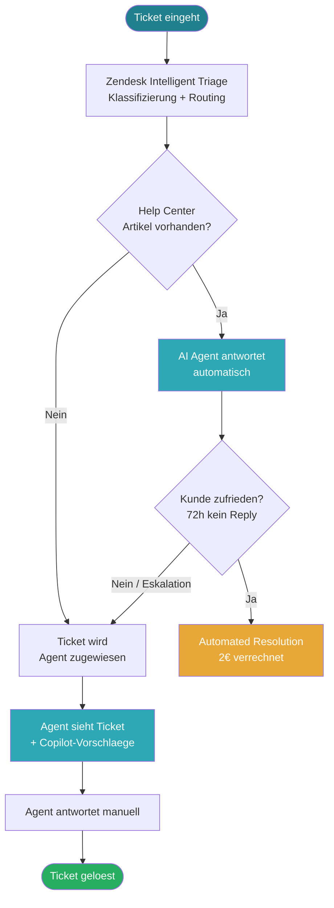
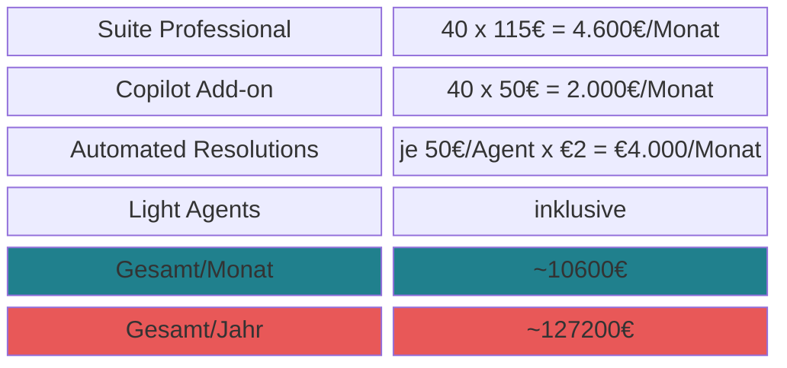
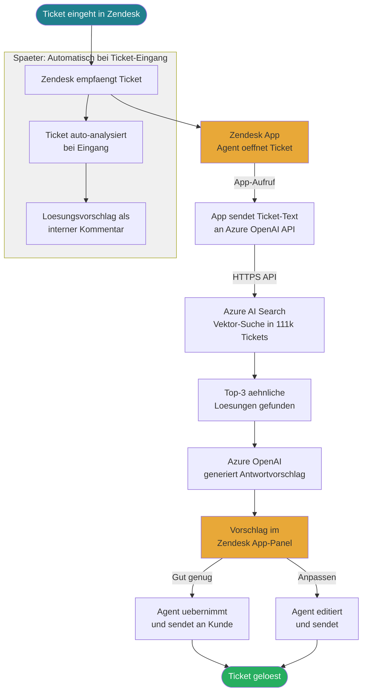
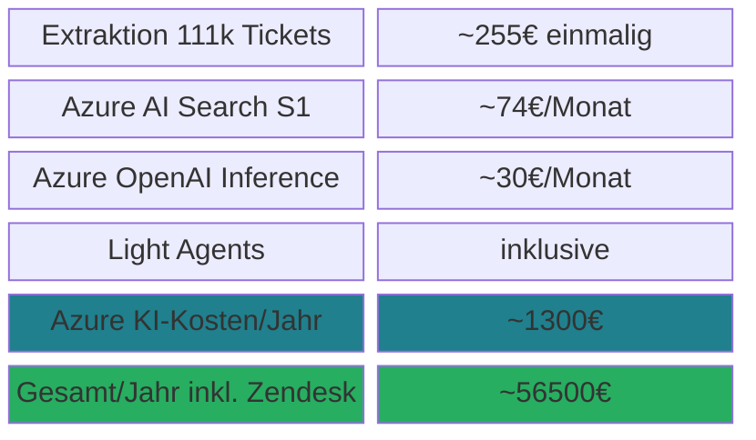
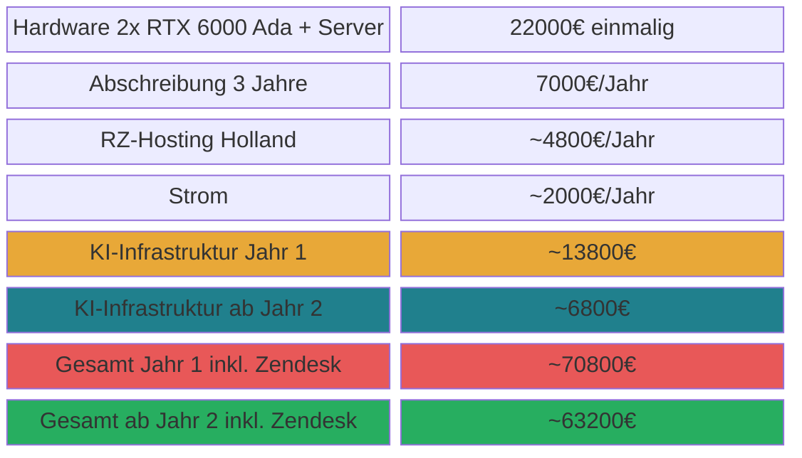
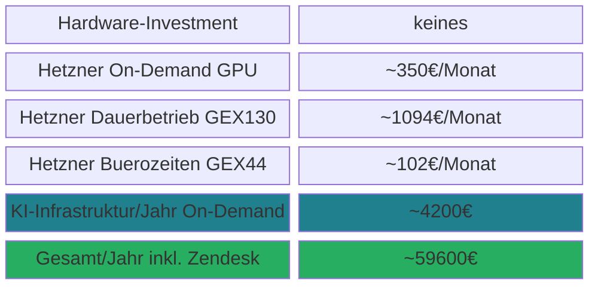
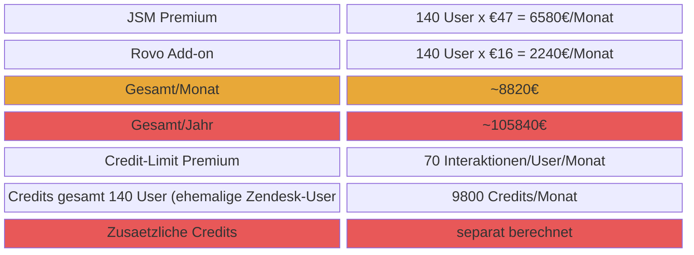
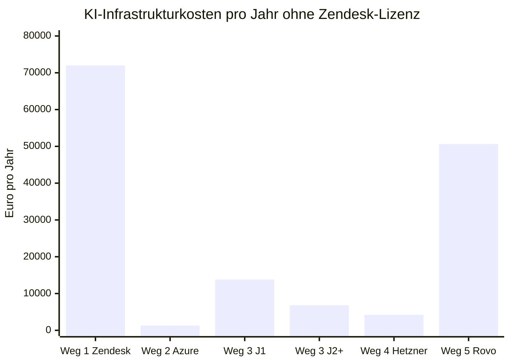

Wichtige Vorabbemerkung zu Zendesk Light Agents: Light Agents sind in der Suite Professional bereits inklusive — sie zahlen keine zusätzliche Lizenz. Bei Rovo hingegen wird jeder User mit Zugriff berechnet, also auch die 100 Light Agents.

Zendesk Native AI

        
Azure Full Stack

Eigener Server RZ Holland

Hetzner GPU-Cloud

Atlassian Rovo

Direktvergleich KI-Infrastruktur (

