# KI-Support-Strategie: Variantenvergleich

> **Hinweis Zendesk Light Agents:** Light Agents sind in der Suite Professional bereits inklusive — keine zusaetzliche Lizenz.  
> **Hinweis Rovo:** Jeder User mit Zugriff wird berechnet, also auch alle 100 Light Agents. Rovo-Abfragen sind auf den jeweiligen Zugriffsbereich des Agenten beschraenkt — Tickets ausserhalb seines Bereichs werden nicht beruecksichtigt.

---

## Wissensbasis — Kritische Grundlage fuer alle Wege

> **Wichtiger Hinweis zur Datenqualitaet:** Die vorhandenen Help-Center-Artikel sind **stark Swyx-lastig** und decken die Produkte der Communications-Sparte nur unzureichend ab. Eine rein artikel-basierte Wissensbasis liefert daher fuer einen Grossteil der eingehenden Tickets **keine relevanten Antworten**.

> **Ticketbasis:** Gesamt ~180.000 Tickets im System. Fuer die KI-Verarbeitung relevant: **ca. 111.000 Tickets** (mehr als 2 Antworten, nicht aelter als 5 Jahre). Nur diese gefilterte Basis liefert qualitativ verwertbare Loesungsmuster.

| Wissensbasis | Quelle | Qualitaet | Abdeckung |
|---|---|---|---|
| Nur Help-Center-Artikel | Swyx-lastig, lueckenhaft | Gering | L1-Tickets, Swyx-Produkte |
| Artikel + RAG ueber 111k Tickets | Gefilterte Ticketbasis | Hoch | L1/L2/L3, alle Produkte |

**Fazit:** Echter Mehrwert entsteht **nur durch RAG** ueber die gefilterten 111k Tickets — unabhaengig davon, ob Azure AI Search, Qdrant auf eigenem Server oder Qdrant bei Hetzner genutzt wird. Alle Wege ohne RAG sind als **temporaere PoC-Loesung** zu verstehen.

---

## Weg 1 — Zendesk Native AI

> **Empfehlung:** Nur geeignet wenn kein eigenes technisches Know-how vorhanden ist und L1-Tickets dominieren. Fuer L2/L3-lastigen Support wie Enreach/Swyx **nicht empfohlen** — teuerste Option ohne Zugriff auf historische Ticket-Loesungen. Wissensbasis beschraenkt auf Help-Center-Artikel (Swyx-lastig, keine Communications-Produkte).

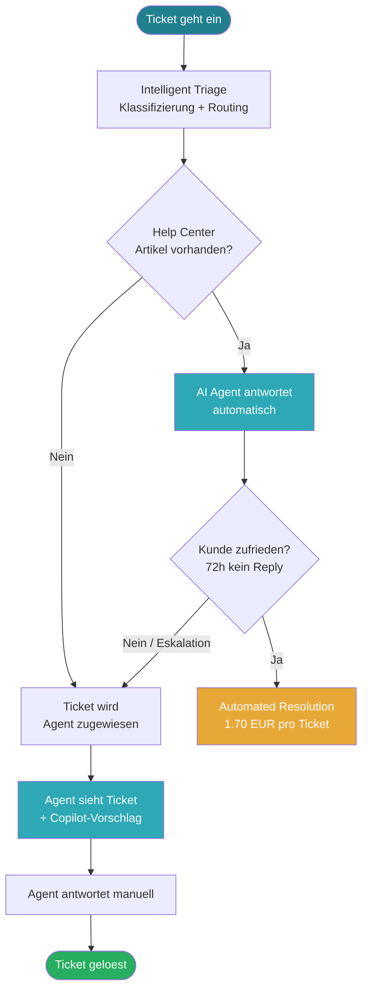

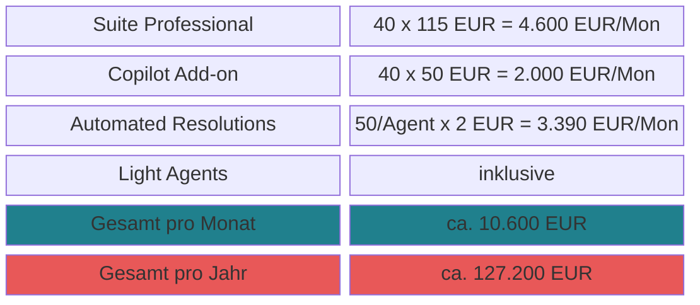

---

## Weg 1a — Flask-Server direkt via Azure OpenAI (RZ Holland)

> **Empfehlung:** Schnellster und schlankster Einstieg als Proof-of-Concept. Webhook-Integration bereits vorhanden, kein zusaetzlicher Middleware-Layer. Flask-Code ruft Azure OpenAI direkt auf — volle Kontrolle, minimale Latenz, keine DialoX-Lizenzabhaengigkeit.  
> **Wissensbasis:** Help-Center-Artikel als Prompt-Kontext + optional wenige historische Tickets. Antwortqualitaet bei Communications-Produkten eingeschraenkt. Kein RAG. **Nur als PoC bis Weg 2 produktiv ist.**  
> **Inference-Kalkulation:** ~800 Input-Token (System-Prompt + Artikel + Ticket-Text) + ~500 Output-Token. GPT-4o: ~6 EUR/Monat bei 1.000 Anfragen/Monat (~77 EUR/Jahr).

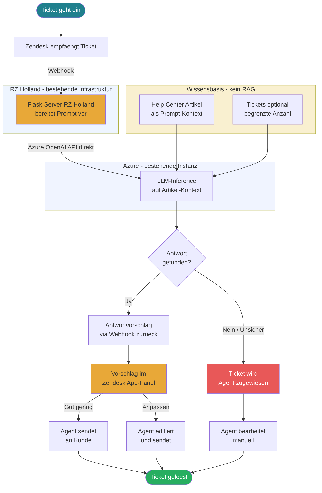

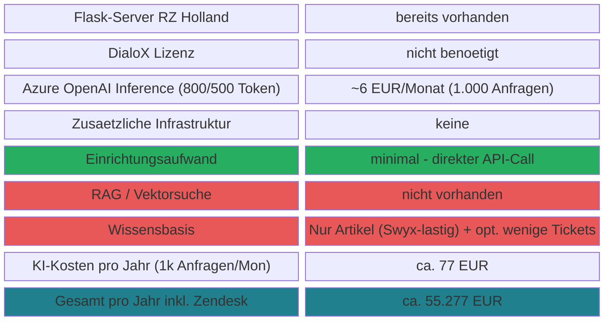

---

## Weg 1b — DialoX als Middleware-Layer via Flask-Server (RZ Holland)

> **Empfehlung:** Nur sinnvoll wenn DialoX aktiv fuer weitere Dialog-Features genutzt wird (Multi-Bot-Routing, Session-Management). Als reiner Pass-Through zu Azure OpenAI kein architektonischer Mehrwert gegenueber Weg 1a — ein zusaetzlicher API-Hop, eine zusaetzliche Abhaengigkeit.  
> **Wissensbasis:** Ausschliesslich Help-Center-Artikel — DialoX kann die 111k Tickets volumenseitig nicht verarbeiten. Strukturell vergleichbar mit Weg 1 (Zendesk Native). **Nur als PoC geeignet.**  
> **Inference-Kalkulation:** Gleich wie Weg 1a — ~800 Input-Token + ~500 Output-Token. GPT-4o: ~6 EUR/Monat bei 1.000 Anfragen/Monat (~77 EUR/Jahr).

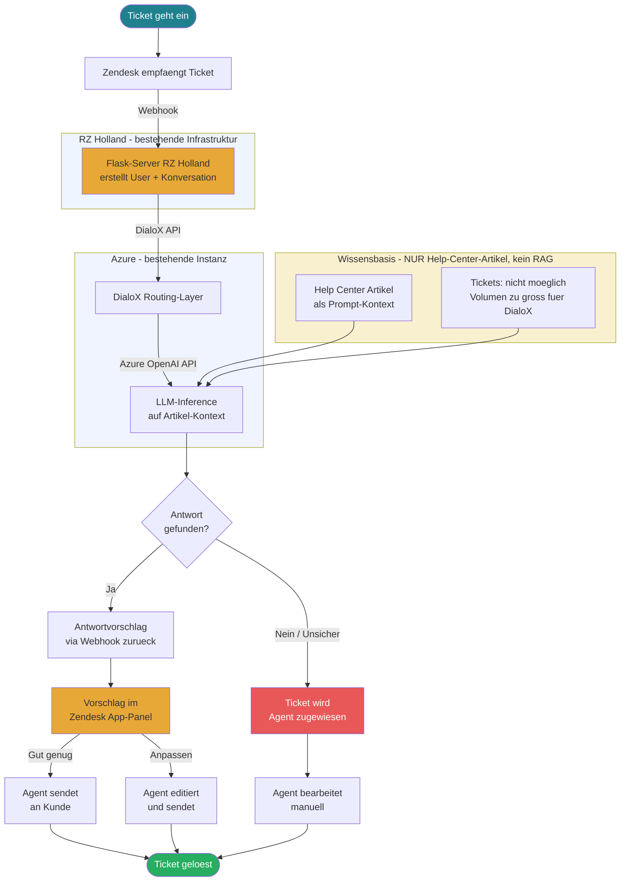

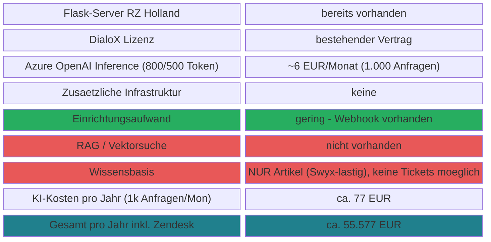

---

## Weg 2 — Azure RAG (Full Stack)

> **Wichtiger Hinweis:** Der Name "Full Stack" ist erst dann zutreffend, wenn **Azure AI Search mit Vektorindex aktiv laeuft** — nur dann findet echtes semantisches Retrieval statt. Ohne Search-Komponente waere Weg 2 strukturell identisch mit Weg 1a.  
> **Kein Fine-Tuning:** Das Basis-Modell (z.B. GPT-4o) wird nicht veraendert oder trainiert. RAG liefert Wissen dynamisch zur Laufzeit. Fine-Tuning wuerde ein statisches, schnell veraltetes Modell erzeugen und ~1.224 EUR/Monat reines Hosting kosten — hier **nicht vorgesehen**.  
> **Wissensbasis:** 111k gefilterte Tickets (>2 Antworten, <5 Jahre) als Vektorindex + Help-Center-Artikel. Erstmals vollstaendige Abdeckung aller Produkte inkl. Communications.  
> **Inference-Kalkulation:** ~4.000 Input-Token/Anfrage (Ticket-Text + RAG-Kontext Top-3) + ~1.500 Output-Token. GPT-4o Global: $2,50/1M Input, $10,00/1M Output (Stand Feb 2026).

> **Empfehlung:** **Beste Option fuer den Einstieg mit echter KI-Qualitaet.** Infrastruktur bereits vorhanden, Extraktion laeuft, minimales Hardware-Risiko. Ideal fuer die ersten 6-12 Monate.

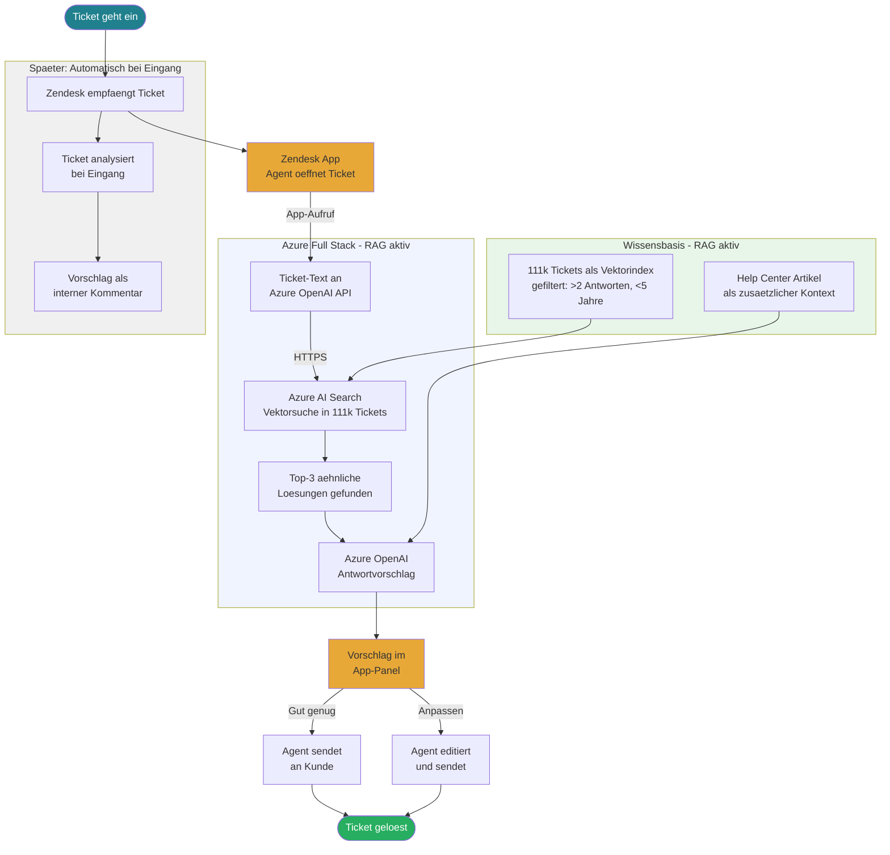

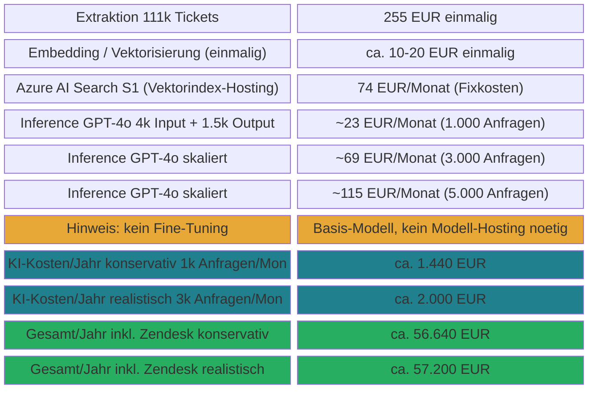

---

## Weg 3 — Eigener Server RZ Holland (RAG)

> **Empfehlung:** Sinnvoll ab Jahr 2 wenn Weg 2 validiert ist und weitere KI-Anwendungsfaelle (z.B. Sprach-Transkription, interne Tools) hinzukommen. Volle Datenkontrolle, hoechste DSGVO-Sicherheit, aber signifikantes Hardware-Investment und Betriebsaufwand.  
> **Wissensbasis:** 111k gefilterte Tickets als Vektorindex in Qdrant (On-Premise) + Help-Center-Artikel. Gleiche RAG-Qualitaet wie Weg 2, keine variablen Inference-Kosten da lokales LLM.

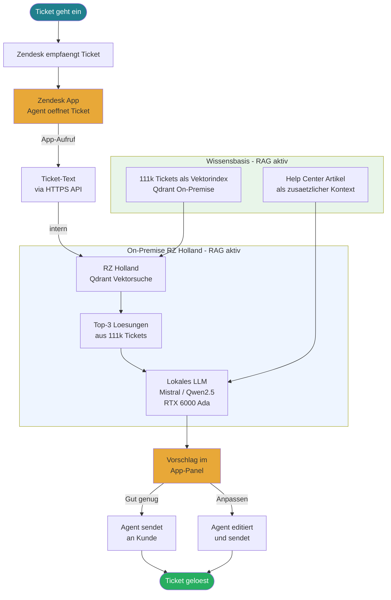

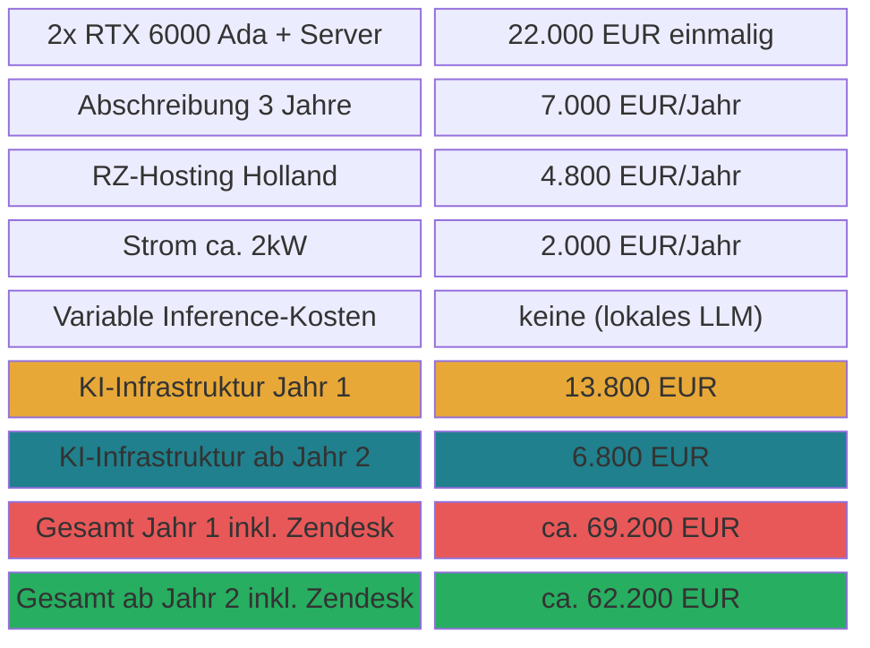

---

## Weg 4 — Hetzner GPU-Cloud (RAG)

> **Empfehlung:** **Beste Langzeit-Option** nach Validierung mit Weg 2. Kein Hardware-Investment, DSGVO-konform in Deutschland, On-Demand skalierbar. Migration von Weg 2 auf Weg 4 erfordert keine Aenderungen an der Zendesk App.  
> **Wissensbasis:** 111k gefilterte Tickets als Vektorindex in Qdrant (Hetzner DE) + Help-Center-Artikel. Gleiche RAG-Qualitaet wie Weg 2 und 3. Keine variablen Inference-Kosten da lokales LLM.

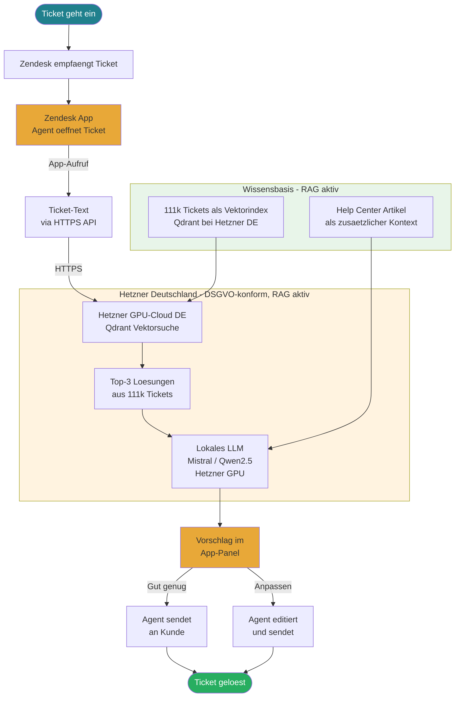

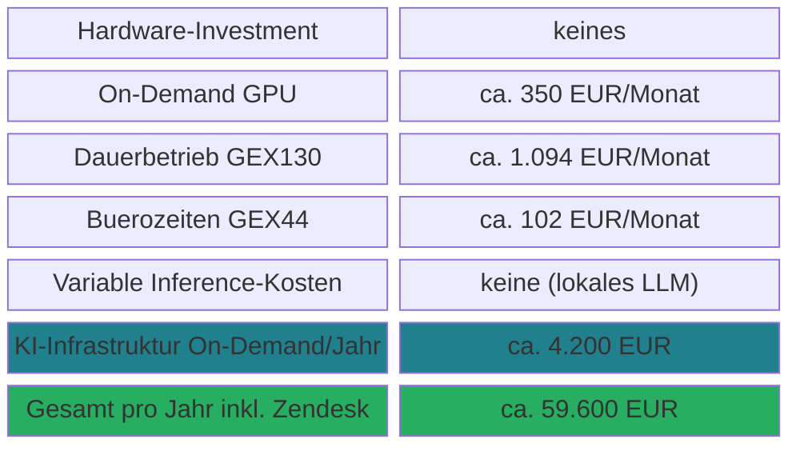

---

## Weg 5 — Atlassian Rovo (setzt JSM-Migration voraus)

> **Empfehlung:** Nur sinnvoll wenn eine **vollstaendige Migration von Zendesk auf JSM** geplant ist. Credit-Limit von 70 Interaktionen/User/Monat ist fuer produktiven Support unzureichend.  
> **Wissensbasis — kritischer Punkt:** Echter Mehrwert entsteht **nur wenn die 111k Zendesk-Tickets sauber nach JSM migriert werden**. Ohne Migration: nur Swyx-lastige Artikel — strukturell vergleichbar mit Weg 1.  
> **Migrationskosten Zendesk → JSM:** Externes Angebot vorliegend: ~8.000 EUR fuer Ticket-Uebernahme. Marktdurchschnitt laut Branchenquellen: 10.000–50.000 EUR fuer Professional Services. Hinzu kommen interne Admin-Kosten beider Seiten (Zendesk- und JSM-Admins), schaetzungsweise 15–30 Personentage a 800 EUR = 12.000–24.000 EUR. Datenverlust-Risiko: 15–20% der Custom Fields und Automatisierungsregeln nicht migrierbar. Parallelbetrieb waehrend Uebergang: ~2 Wochen Doppellizenz. **Gesamtmigration realistisch: 20.000–60.000 EUR einmalig.**

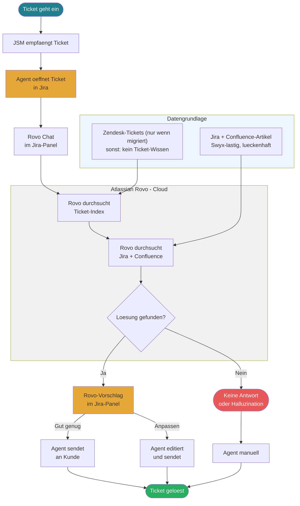

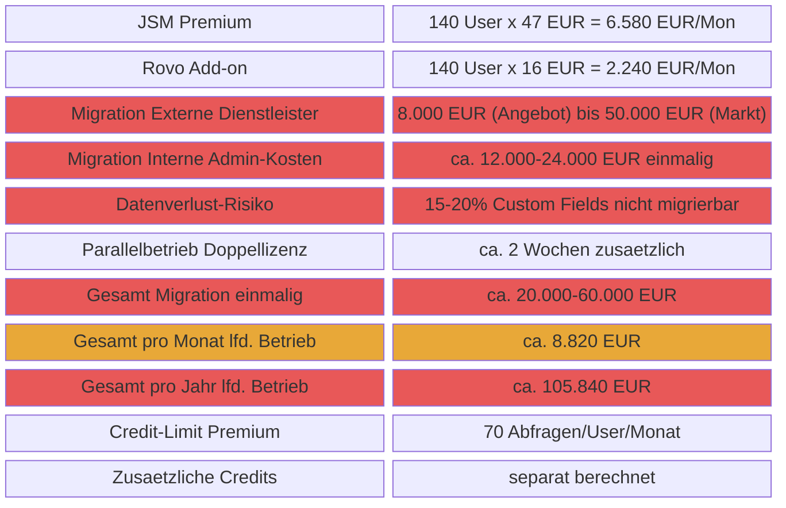

---

## Direktvergleich KI-Infrastruktur

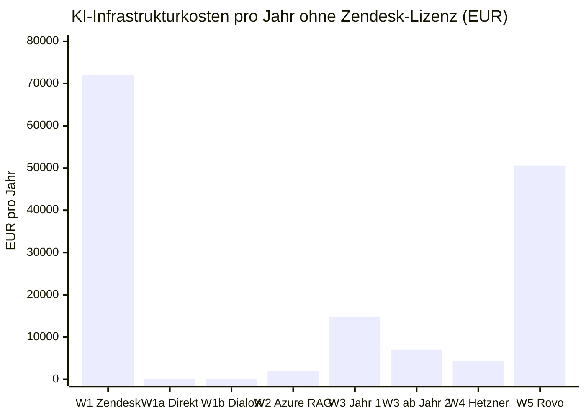

## Direktvergleich Gesamtkosten inkl. Zendesk / Jira-Lizenzen

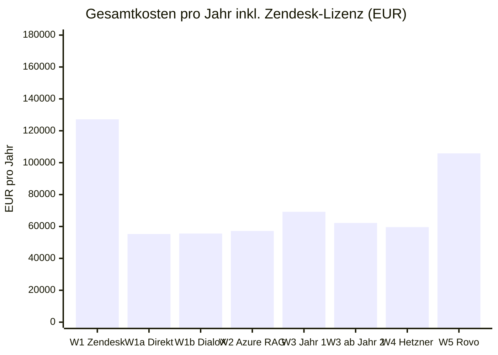
