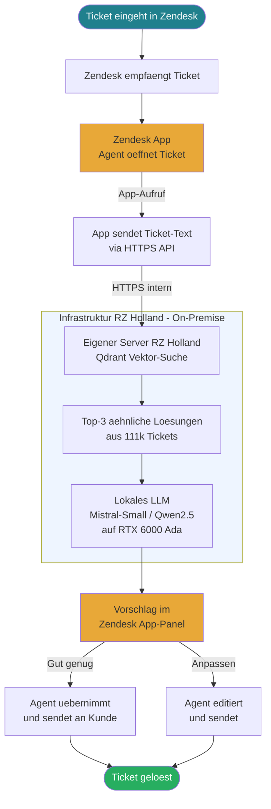
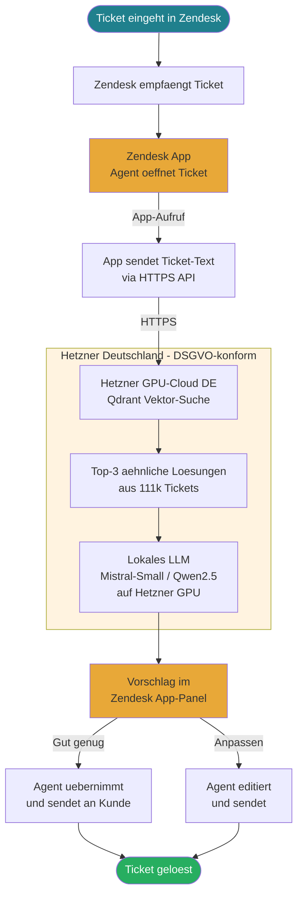
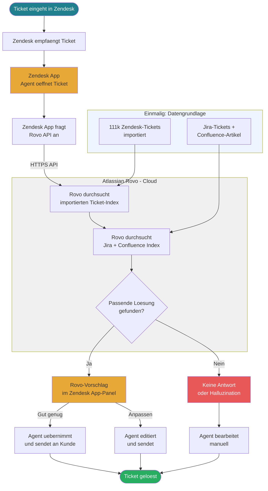

Zendesk Native AI

```mermaid
flowchart TD
    A([Ticket eingeht]) --> B[Zendesk Intelligent Triage<br>Klassifizierung + Routing]
    B --> C{Help Center<br>Artikel vorhanden?}
    C -->|Ja| D[AI Agent antwortet<br>automatisch]
    C -->|Nein| E[Ticket wird<br>Agent zugewiesen]
    D --> F{Kunde zufrieden?<br>72h kein Reply}
    F -->|Ja| G[Automated Resolution<br>$2 verrechnet]
    F -->|Nein / Eskalation| E
    E --> H[Agent sieht Ticket<br>+ Copilot-Vorschlaege]
    H --> I[Agent antwortet manuell]
    I --> J([Ticket geloest])

    style A fill:#20808D,color:#fff
    style G fill:#E8A838,color:#fff
    style J fill:#27AE60,color:#fff
    style D fill:#2EA8B5,color:#fff
    style H fill:#2EA8B5,color:#fff
```

Azure Full Stack

```mermaid
flowchart TD
    A([Ticket eingeht in Zendesk]) --> B[Zendesk empfaengt Ticket]
    B --> C[Zendesk App<br>Agent oeffnet Ticket]
    C -->|App-Aufruf| D[App sendet Ticket-Text<br>an Azure OpenAI API]
    D -->|HTTPS API| E[Azure AI Search<br>Vektor-Suche in 111k Tickets]
    E --> F[Top-3 aehnliche<br>Loesungen gefunden]
    F --> G[Azure OpenAI<br>generiert Antwortvorschlag]
    G --> H[Vorschlag im<br>Zendesk App-Panel]
    H -->|Gut genug| I[Agent uebernimmt<br>und sendet an Kunde]
    H -->|Anpassen| K[Agent editiert<br>und sendet]
    I --> L([Ticket geloest])
    K --> L

    subgraph PHASE2 [Spaeter: Automatisch bei Ticket-Eingang]
        B --> M[Ticket auto-analysiert<br>bei Eingang]
        M --> N[Loesungsvorschlag als<br>interner Kommentar]
    end

    style A fill:#20808D,color:#fff
    style C fill:#E8A838,color:#333
    style H fill:#E8A838,color:#333
    style L fill:#27AE60,color:#fff
    style PHASE2 fill:#f0f0f0,color:#333
```

Eigener Server RZ Holland

```mermaid
flowchart TD
    A([Ticket eingeht in Zendesk]) --> B[Zendesk empfaengt Ticket]
    B --> C[Zendesk App<br>Agent oeffnet Ticket]
    C -->|App-Aufruf| D[App sendet Ticket-Text<br>via HTTPS API]
    D -->|HTTPS intern| E[Eigener Server RZ Holland<br>Qdrant Vektor-Suche]
    E --> F[Top-3 aehnliche Loesungen<br>aus 111k Tickets]
    F --> G[Lokales LLM<br>Mistral-Small / Qwen2.5<br>auf RTX 6000 Ada]
    G --> H[Vorschlag im<br>Zendesk App-Panel]
    H -->|Gut genug| I[Agent uebernimmt<br>und sendet an Kunde]
    H -->|Anpassen| K[Agent editiert<br>und sendet]
    I --> L([Ticket geloest])
    K --> L

    subgraph INFRA [Infrastruktur RZ Holland - On-Premise]
        E
        F
        G
    end

    style A fill:#20808D,color:#fff
    style C fill:#E8A838,color:#333
    style H fill:#E8A838,color:#333
    style L fill:#27AE60,color:#fff
    style INFRA fill:#eef5ff,color:#333
```

Hetzner GPU-Cloud

```mermaid
flowchart TD
    A([Ticket eingeht in Zendesk]) --> B[Zendesk empfaengt Ticket]
    B --> C[Zendesk App<br>Agent oeffnet Ticket]
    C -->|App-Aufruf| D[App sendet Ticket-Text<br>via HTTPS API]
    D -->|HTTPS| E[Hetzner GPU-Cloud DE<br>Qdrant Vektor-Suche]
    E --> F[Top-3 aehnliche Loesungen<br>aus 111k Tickets]
    F --> G[Lokales LLM<br>Mistral-Small / Qwen2.5<br>auf Hetzner GPU]
    G --> H[Vorschlag im<br>Zendesk App-Panel]
    H -->|Gut genug| I[Agent uebernimmt<br>und sendet an Kunde]
    H -->|Anpassen| K[Agent editiert<br>und sendet]
    I --> L([Ticket geloest])
    K --> L

    subgraph HETZNER [Hetzner Deutschland - DSGVO-konform]
        E
        F
        G
    end

    style A fill:#20808D,color:#fff
    style C fill:#E8A838,color:#333
    style H fill:#E8A838,color:#333
    style L fill:#27AE60,color:#fff
    style HETZNER fill:#fff3e0,color:#333
```

Atlassian Rovo

```mermaid
flowchart TD
    A([Ticket eingeht in Zendesk]) --> B[Zendesk empfaengt Ticket]
    B --> C[Zendesk App<br>Agent oeffnet Ticket]
    C --> D[Zendesk App fragt<br>Rovo API an]
    D -->|HTTPS API| E[Rovo durchsucht<br>importierten Ticket-Index]
    E --> F[Rovo durchsucht<br>Jira + Confluence Index]
    F --> G{Passende Loesung<br>gefunden?}
    G -->|Ja| H[Rovo-Vorschlag<br>im Zendesk App-Panel]
    G -->|Nein| X[Keine Antwort<br>oder Halluzination]
    H -->|Gut genug| I[Agent uebernimmt<br>und sendet an Kunde]
    H -->|Anpassen| K[Agent editiert<br>und sendet]
    X --> J[Agent bearbeitet<br>manuell]
    I --> L([Ticket geloest])
    K --> L
    J --> L

    subgraph ROVO [Atlassian Rovo - Cloud]
        E
        F
        G
    end

    subgraph IMPORT [Einmalig: Datengrundlage]
        Z1[111k Zendesk-Tickets<br>importiert] --> E
        Z2[Jira-Tickets +<br>Confluence-Artikel] --> F
    end

    style A fill:#20808D,color:#fff
    style C fill:#E8A838,color:#333
    style H fill:#E8A838,color:#333
    style L fill:#27AE60,color:#fff
    style X fill:#E85858,color:#fff
    style ROVO fill:#f0f0f0,color:#333
    style IMPORT fill:#eef5ff,color:#333
```
