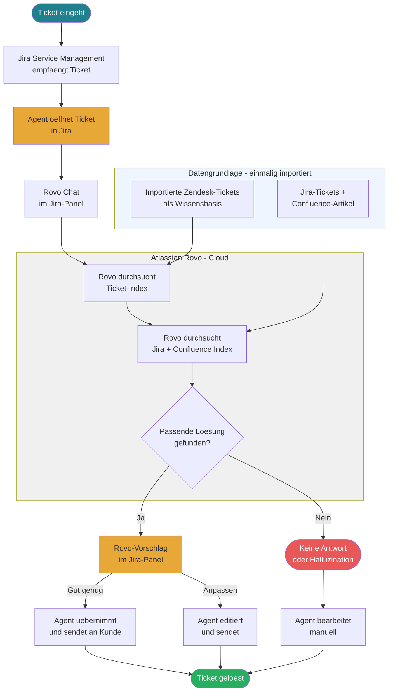

Wichtige Vorabbemerkung zu Zendesk Light Agents: Light Agents sind in der Suite Professional bereits inklusive — sie zahlen keine zusätzliche Lizenz. Bei Rovo hingegen wird jeder User mit Zugriff berechnet, also auch die 100 Light Agents.


Zendesk Native AI


KOSTEN1[Suite Professional: 40 x $115 = $4.600/Monat
        Light Agents: inklusive in Suite Professional
        Copilot Add-on: 40 x $50 = $2.000/Monat
        Automated Resolutions: Ø 50/Agent x $2 = $4.000/Monat
        ─────────────────────────────────────
        Gesamt/Monat: ~$10.600
        Gesamt/Jahr:  ~$127.200]

        
Azure Full Stack

KOSTEN2[Einmalig Extraktion 111k Tickets: ~$255
        Azure AI Search S1: ~$74/Monat
        Azure OpenAI Inference: ~$30/Monat (hochgerechnet 40 Agenten)
        Zendesk Suite Professional: 40 x $115 = $4.600/Monat
        Light Agents: inklusive
        ─────────────────────────────────────
        Zendesk-Lizenz/Jahr: ~$55.200
        Azure-Kosten/Jahr:   ~$1.300
        Gesamt/Jahr:         ~$56.500]


Eigener Server RZ Holland

KOSTEN3[Zendesk Suite Professional: 40 x $115 = $4.600/Monat
        Light Agents: inklusive
        ─────────────────────────────────────
        Hardware 2x RTX 6000 Ada + Server: ~22.000 EUR einmalig
        Abschreibung 3 Jahre: ~7.000 EUR/Jahr
        RZ-Hosting Holland: ~4.800 EUR/Jahr
        Strom: ~2.000 EUR/Jahr
        ─────────────────────────────────────
        Zendesk-Lizenz/Jahr:    ~$55.200
        KI-Infrastruktur Jahr 1: ~13.800 EUR
        KI-Infrastruktur ab J2:  ~6.800 EUR
        Gesamt Jahr 1:          ~$70.800
        Gesamt ab Jahr 2:       ~$63.200]


Hetzner GPU-Cloud

KOSTEN4[Zendesk Suite Professional: 40 x $115 = $4.600/Monat
        Light Agents: inklusive
        ─────────────────────────────────────
        Kein Hardware-Investment
        Hetzner On-Demand GPU: ~350 EUR/Monat
        ─────────────────────────────────────
        Zendesk-Lizenz/Jahr:  ~$55.200
        Hetzner/Jahr:         ~4.200 EUR
        Gesamt/Jahr:          ~$59.600]


Atlassian Rovo

KOSTEN5[JSM Premium: 140 User x $47/Monat = $6.580/Monat
        Rovo Add-on: 140 User x $16/Monat = $2.240/Monat
        ─────────────────────────────────────
        Gesamt/Monat: ~$8.820
        Gesamt/Jahr:  ~$105.840
        ─────────────────────────────────────
        Credit-Limit Premium: 70 Interaktionen/User/Monat
        Bei 140 Usern: 9.800 Credits/Monat gesamt
        Zusaetzliche Credits: separat berechnet]


Direktvergleich KI-Infrastruktur (
```mermaid
***
config:
  xyChart:
    width: 900
    height: 500
***
xychart-beta
    title "Jaehrliche KI-Infrastrukturkosten im Vergleich (ohne Zendesk-Lizenz)"
    x-axis ["Weg 1 Zendesk Native", "Weg 2 Azure", "Weg 3 Server J1", "Weg 3 Server J2+", "Weg 4 Hetzner", "Weg 5 Rovo/JSM"]
    y-axis "Kosten USD/Jahr" 0 --> 80000
    bar 
```

